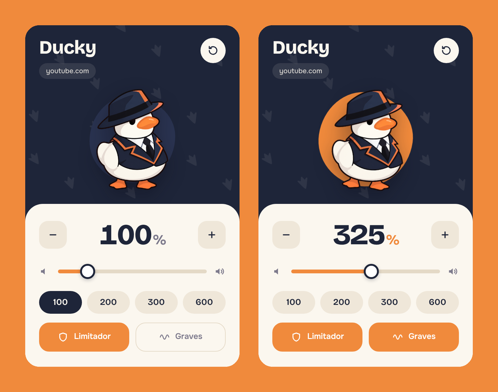

<p align="center">
  
</p>

<h1 align="center">Ducky</h1>

<p align="center">
  Sube el volumen de cualquier video o página hasta <b>600 %</b>, sin que se distorsione.<br />
  Extensión para Chrome y Edge (Manifest V3).
</p>

<p align="center">
  
</p>

---

## Qué hace

- **Hasta 600 %** de volumen en YouTube, Netflix, Twitch, Facebook, Spotify Web y casi cualquier sitio con `<video>` o `<audio>`.
- **Limitador** que evita que el sonido sature al subirlo.
- **Refuerzo de graves** de +8 dB con un clic.
- **Memoria por sitio:** cada página recuerda su propio volumen. Las páginas nuevas empiezan en 100 %.
- **Medidor en vivo:** el círculo detrás del pato late con el audio y se pone rojo si satura.
- **Atajos de teclado** desde cualquier pestaña.
- **Ligera:** no toca el audio de la página mientras estés en 100 %, y se pone en reposo cuando no suena nada.

## Instalación

1. Descarga el repositorio (**Code → Download ZIP**) y descomprímelo, o clónalo:
   ```bash
   git clone https://github.com/mob949k/ducky.git
   ```
2. Abre `chrome://extensions` (o `edge://extensions`).
3. Activa el **Modo de desarrollador**.
4. Pulsa **Cargar descomprimida** y elige la carpeta del proyecto.
5. Recarga las pestañas que ya tenías abiertas.

## Uso

Haz clic en el pato de la barra de extensiones y:

- Arrastra el deslizador o usa la rueda del ratón sobre él.
- Pulsa **−** / **+** para bajar o subir de 25 en 25.
- Elige un nivel rápido: 100, 200, 300 o 600.
- Activa o desactiva **Limitador** y **Graves**.
- El botón redondo de arriba vuelve todo a 100 %.

### Atajos

| Acción          | Atajo             |
| --------------- | ----------------- |
| Subir 25 %      | `Alt + Shift + ↑` |
| Bajar 25 %      | `Alt + Shift + ↓` |
| Volver a 100 %  | `Alt + Shift + 0` |

Puedes cambiarlos en `chrome://extensions/shortcuts`.

## Limitaciones

- **Videos servidos desde otro dominio sin permisos CORS** no se pueden amplificar. El navegador no lo permite. Ducky los detecta y los deja sonar a volumen normal en vez de silenciarlos.
- **Páginas internas del navegador** (`chrome://`, Chrome Web Store) no admiten extensiones.
- La amplificación empieza después de tu primer clic o tecla en la página, por las reglas de reproducción automática del navegador.

## Cómo funciona

Ducky enruta cada `<video>` y `<audio>` por una sola cadena de Web Audio compartida en cada frame:

```
medios de la página → graves (lowshelf 180 Hz) → ganancia → limitador → altavoces
                                                                 └→ analizador (medidor)
```

## Estructura

```
├── manifest.json     Permisos, íconos y atajos
├── content.js        Motor de audio (se inyecta en cada página)
├── background.js     Insignia con el porcentaje y atajos de teclado
├── popup.html        Interfaz
├── popup.css         Estilos
├── popup.js          Lógica de la interfaz y medidor
├── duck.png          Logo
├── icon16…128.png    Íconos de la barra
├── fonts/            Bricolage Grotesque y Onest
└── docs/             Imágenes del README
```

## Permisos

| Permiso                      | Para qué                                            |
| ---------------------------- | --------------------------------------------------- |
| `storage`                    | Guardar el volumen de cada sitio en tu navegador    |
| `activeTab`                  | Saber en qué sitio estás al abrir la ventana        |
| `host_permissions: <all_urls>` | Poder amplificar el audio en cualquier página     |

Ducky no recopila datos ni se conecta a ningún servidor. Todo queda en tu navegador.

## Créditos

Las tipografías [Bricolage Grotesque](https://fonts.google.com/specimen/Bricolage+Grotesque) y [Onest](https://fonts.google.com/specimen/Onest) se distribuyen bajo la [SIL Open Font License 1.1](https://openfontlicense.org).
